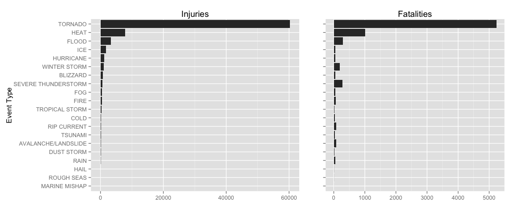
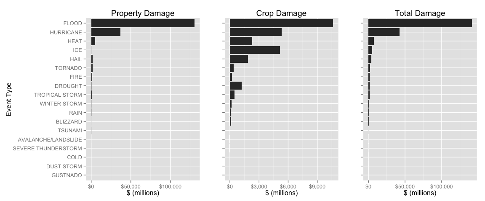

# Storm Data Analysis

## Synopsis
Storms and other severe weather events can cause both public health and economic problems for communities and municipalities. Many severe events can result in fatalities, injuries, and property damage, and preventing such outcomes to the extent possible is a key concern.

This analysis involves exploring the U.S. National Oceanic and Atmospheric Administration's (NOAA) storm database. This database tracks characteristics of major storms and weather events in the United States, including when and where they occur, as well as estimates of any fatalities, injuries, and property damage.

This analysis addresses the following questions:
1. Across the United States, which types of events (as indicated in the EVTYPE variable) are most harmful with respect to population health?
2. Across the United States, which types of events have the greatest economic consequences?

## Data Processing

```r
library(yaml)
library(dplyr)
library(magrittr)
library(stringr)
library(ggplot2)
library(grid)
library(gridExtra)
library(scales)

# this is a configuration file that provides the data definitions needed by this analysis.
# It is copied below for review.
conf <- yaml.load_file("analysis.conf") 

# ---
# # analysis.conf configuration file in yaml format
# 
# storm_url: "https://d396qusza40orc.cloudfront.net/repdata%2Fdata%2FStormData.csv.bz2"
# destfile: "StormData.csv.bz2"
# 
# evtype:
#     "blizzard": "BLIZZARD"
#     "dust": "DUST STORM"
#     "storm surge": "COASTAL FLOOD"
#     "flood|fld": "FLOOD"
#     "wind": "HIGH WIND"
#     "hurricane|cyclone|typhoon": "HURRICANE"
#     "thunderstorm|lightning": "SEVERE THUNDERSTORM"
#     "tornado|funnel|waterspout": "TORNADO"
#     "tsunami": "TSUNAMI"
#     "snow|winter|wintry|mixed precip": "WINTER STORM"
# 

#     "heat|hot|warm|high": "HEAT"
#     "cold|low|cool": "COLD"
#     "tropical storm|coastal storm": "TROPICAL STORM"
#     "hail": "HAIL"
#     "rain|shower": "RAIN"
#     "ice|icy|glaze|freez": "ICE"
#     "fire": "FIRE"
#     "fog": "FOG"
#     "dry": "DROUGHT"
#     "rip current": "RIP CURRENT"
#     "avalanche|landslide": "AVALANCHE/LANDSLIDE"
#     "frost": "FROST"
# ...

if (!file.exists(conf$destfile)) {
        download.file(url = conf$storm_url, 
                      destfile = conf$destfile,
                      method = "curl") 
}
# This takes a very long time:
if (!exists("storm_df")) {
        storm_df <- read.csv(conf$destfile, stringsAsFactors=FALSE) %>% 
                tbl_df
}
```

The EVTYPE field has a lot of freeform text and similar types
are consolidated according to National Weather Service 
Emergency Alert System Events. Other types of event types
that did not fall into these categories were grouped by
similarity using my own personal judgement.


```r
storm_df %<>% mutate(Type2 = EVTYPE)
for (oldval in names(conf$evtype)) {
        storm_df %<>% mutate(Type2 = ifelse(grepl(oldval, 
                                            Type2, 
                                            ignore.case=TRUE), 
                                      conf$evtype[[oldval]], 
                                      Type2)) 
}
```
## Results


```r
impact_summary <- storm_df %>% 
        filter(FATALITIES > 0 & INJURIES > 0) %>%
        select(Type2, FATALITIES, INJURIES) %>% 
        group_by(Type2) %>% 
        summarize(fatal = sum(FATALITIES), injury = sum(INJURIES)) %>% 
        arrange(desc(injury), desc(fatal)) 
```

The following plot shows injuries and fatalities by event type for the 20 evnt types with the most injuries, sorted according to the number of injuries.

 

The economic consequences of the storms is given in terms of total damage in US dollars, which includes property damage and crop damage.


```r
DMGEXP <- list("K"=10^3, "M"=10^6, "B"=10^9)

storm_df$PROPDMG_TOT <- mapply(function(x, y) ifelse(x %in% names(DMGEXP), 
                                                  y * DMGEXP[[x]], y),
                               x = storm_df$PROPDMGEXP,
                               y = storm_df$PROPDMG)

storm_df$CROPDMG_TOT <- mapply(function(x, y) ifelse(x %in% names(DMGEXP), 
                                                  y * DMGEXP[[x]], y),
                               x = storm_df$CROPDMGEXP,
                               y = storm_df$CROPDMG)

econ_summary <- storm_df %>% 
        filter(PROPDMG_TOT > 0 & CROPDMG_TOT > 0) %>%
        mutate(DMG_TOT = PROPDMG_TOT + CROPDMG_TOT) %>%
        select(Type2, PROPDMG_TOT, CROPDMG_TOT, DMG_TOT) %>% 
        group_by(Type2) %>% 
        summarize(property = sum(PROPDMG_TOT)/10^6, 
                  crop = sum(CROPDMG_TOT)/10^6,
                  total = sum(DMG_TOT)/10^6) %>% 
        arrange(desc(total)) 
```

The following plot shows property and crop damage by event type for the 20 evnt types with the most total damages, sorted according to total damages.

 

## Summary

In summary, Tornados and floods cause the most injuries and deaths. In terms of fatalities, the third worst event type, floods, is a distant third.

Floods cause the most property damage, the second most crop damage and the most overall damage. Hurricanes are a distant second in economic consequences. Drought causes the most crop damage.


              

